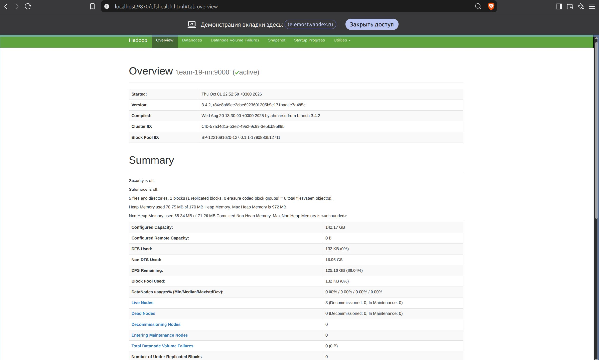
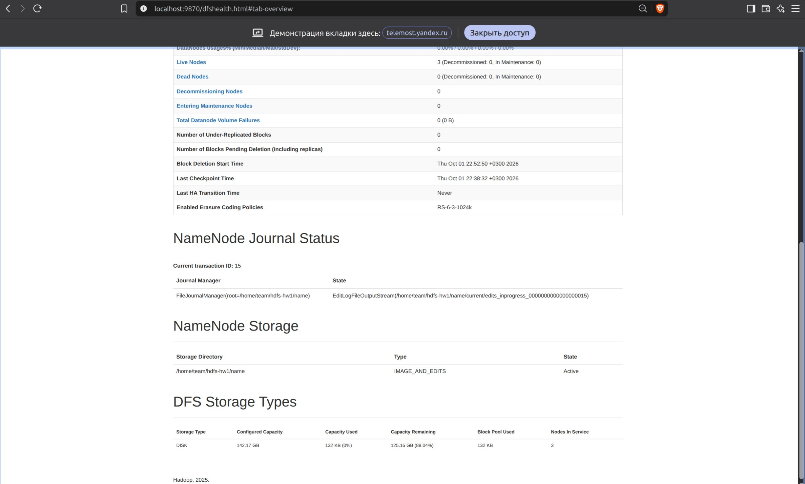

# HDFS Cluster Deployment

Домашнее задание №1 по курсу **Data Platforms**.

Автоматизированное развёртывание HDFS-кластера на предоставленной инфраструктуре.

## Архитектура

| Узел | IP | Роль |
|---|---|---|
| `team-19-nn` | `10.19.0.11` | NameNode |
| `team-19-00` | `10.19.0.12` | DataNode |
| `team-19-01` | `10.19.0.13` | DataNode |
| `team-19-en` | `10.19.0.10` | DataNode + Secondary NameNode |

Итоговая конфигурация:

- 1 NameNode;
- 1 Secondary NameNode;
- 3 DataNode;
- коэффициент репликации — `3`.

Третья DataNode и Secondary NameNode размещены на edge-ноде `team-19-en`.

## Структура проекта

```text
data_platform_team_19/
├── install.sh
├── deploy.sh
├── README.md
├── check.txt
├── fsck.txt
├── checkpoint.txt
└── images/
    ├── IMAGE_1.jpg
    ├── IMAGE_2.jpg
    └── IMAGE_3.jpg
```

### Скрипты

`install.sh` устанавливает OpenJDK 11 и Hadoop 3.4.2 на одном узле, создаёт необходимые каталоги и конфигурацию Hadoop.

`deploy.sh` выполняет автоматическое развёртывание кластера:

1. скачивает Hadoop;
2. устанавливает Hadoop на все четыре узла;
3. форматирует новый NameNode;
4. запускает NameNode;
5. запускает три DataNode;
6. запускает Secondary NameNode.

## Требования

- Ubuntu/Debian;
- OpenJDK 11;
- пользователь `team` на всех узлах;
- `sudo` без пароля;
- SSH-доступ с edge к внутренним узлам;
- ключ `~/.ssh/team_internal` на edge;
- доступные команды `git`, `wget`, `ssh`, `scp`;
- корректное разрешение имён узлов во внутренние IP.

## Развёртывание

### 1. Подключение к edge

```bash
ssh team@178.236.27.75
```

### 2. Получение проекта

```bash
git clone https://github.com/nikepf/data_platform_team_19.git ~/hw1-hdfs
cd ~/hw1-hdfs
```

### 3. Проверка скриптов

```bash
bash -n install.sh
bash -n deploy.sh
```

### 4. Запуск

```bash
bash deploy.sh
```

Используемые параметры:

| Параметр | Значение |
|---|---|
| Hadoop | `3.4.2` |
| OpenJDK | `11` |
| Hadoop home | `~/hadoop-hw1` |
| HDFS data | `~/hdfs-hw1` |
| HDFS URI | `hdfs://team-19-nn:9000` |
| Replication factor | `3` |

## Проверка кластера

Добавить Hadoop в `PATH`:

```bash
export HADOOP_HOME="$HOME/hadoop-hw1"
export PATH="$HADOOP_HOME/bin:$PATH"
```

Проверить DataNode:

```bash
hdfs dfsadmin -report
```

Ожидаемый результат:

```text
Live datanodes (3):
```

Сохранить отчёт:

```bash
hdfs dfsadmin -report > check.txt
```

## Проверка записи и чтения

```bash
printf 'Hello, HDFS!\n' > test.txt

hdfs dfs -mkdir -p /user/team/hw1
hdfs dfs -put -f test.txt /user/team/hw1/test.txt
hdfs dfs -cat /user/team/hw1/test.txt
```

Ожидаемый результат:

```text
Hello, HDFS!
```

## Проверка репликации

```bash
hdfs fsck /user/team/hw1 -files -blocks -locations \
  > fsck.txt && cat fsck.txt
```

Ожидается:

```text
HEALTHY
Live_repl=3
```

Три реплики должны находиться на DataNode:

- `10.19.0.10`;
- `10.19.0.12`;
- `10.19.0.13`.

## Проверка Secondary NameNode

```bash
hdfs --daemon status secondarynamenode
tail -n 50 ~/hadoop-hw1/logs/*secondarynamenode*.log
```

Успешный checkpoint подтверждается сообщением:

```text
Checkpoint done. New Image Size: ...
```

Сохранить подтверждение:

```bash
grep 'Checkpoint done' ~/hadoop-hw1/logs/*secondarynamenode*.log \
  > checkpoint.txt
```

## Web UI

На локальном компьютере открыть SSH-туннель:

```bash
ssh -N \
  -L 9870:team-19-nn:9870 \
  -L 9868:team-19-en:9868 \
  team@178.236.27.75
```

| Сервис | Адрес |
|---|---|
| NameNode | http://localhost:9870 |
| Secondary NameNode | http://localhost:9868 |

В интерфейсе NameNode необходимо проверить:

- 3 работающие DataNode;
- отсутствие Dead DataNode;
- отсутствие деградировавших узлов;
- отсутствие проблем с репликацией.

## Результаты

После развёртывания подтверждены:

- 3 DataNode в состоянии `Normal`;
- успешная запись и чтение файла;
- `Live_repl=3`;
- состояние HDFS — `HEALTHY`;
- успешный checkpoint Secondary NameNode.

Результаты CLI-проверок сохранены в:

- `check.txt`;
- `fsck.txt`;
- `checkpoint.txt`.

### Состояние кластера



### Три работающие DataNode



## Участники

| Участник | Telegram | GitHub |
|---|---|---|
| Николай Епифанов | `@lklklklklk26` | https://github.com/nikepf |
| Сергей Зайцев | `@cep3au` | https://github.com/serzai |
| Павел Ефимов | `@pafimov` | https://github.com/pafimov |
| Эмилия Шмыгина | `@Emi_shhh` | https://github.com/EmiliaShh |