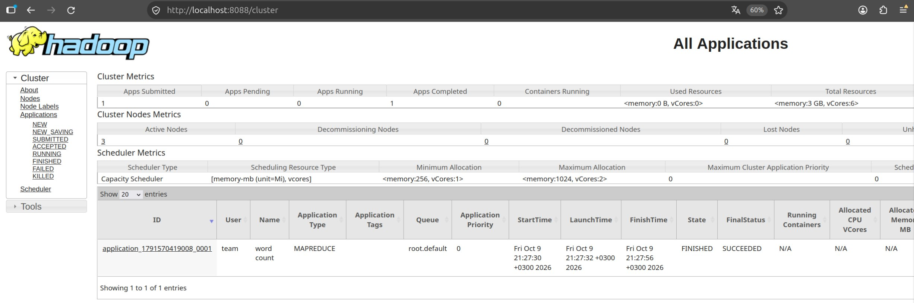
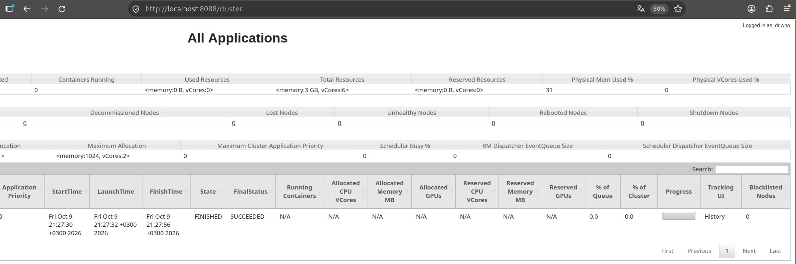
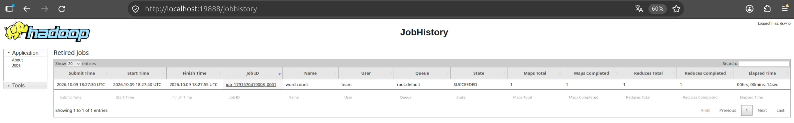
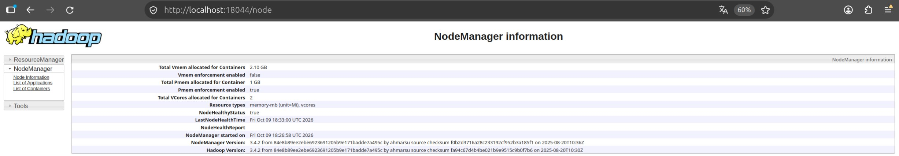

# YARN Cluster Deployment

Домашнее задание №2 

## Архитектура

| Узел | IP | Роль |
|---|---|---|
| `team-19-nn` | `10.19.0.11` | ResourceManager + JobHistoryServer |
| `team-19-00` | `10.19.0.12` | NodeManager |
| `team-19-01` | `10.19.0.13` | NodeManager |
| `team-19-en` | `10.19.0.10` | NodeManager + Nginx |

## Файлы

| Файл | Назначение |
|---|---|
| `configs/yarn-site.xml` | YARN, ресурсы NodeManager, логи |
| `configs/mapred-site.xml` | MapReduce, JobHistoryServer, память контейнеров |
| `setup.sh` | Настройка узла|
| `deploy.sh` | Настройка четырёх узлов, запуск сервисов, установка Nginx |
| `check.sh` | Проверка процессов, узлов, интерфейсов и WordCount |
| `results/` | Отчёты проверки |
| `images/` | Скриншоты |

## Требования

- Ubuntu/Debian, OpenJDK 11, Hadoop 3.4.2 в `/home/team/hadoop-hw1`
- Работающий HDFS с тремя DataNode
- ключ `~/.ssh/team_internal` на edge

## Развёртывание

### 1. Подключение

На локальном компьютере:

```bash
ssh team@178.236.27.75
```

### 2. Репозиторий

```bash
git clone https://github.com/nikepf/data_platform_team_19.git
cd data_platform_team_19/hw2
```

### 3. Проверка среды

На edge:

```bash
~/hadoop-hw1/bin/hdfs dfsadmin -report
free -m
nproc
getent ahostsv4 team-19-en
getent ahostsv4 team-19-en.hse.c.mws
```

Ожидается `Live datanodes (3):`

На внутренних узлах:

```bash
for host in team-19-nn team-19-00 team-19-01; do
  ssh -i ~/.ssh/team_internal "team@$host" \
    'hostname -s; free -m; nproc; getent ahostsv4 "$(hostname -s)"; getent ahostsv4 "$(hostname -s).hse.c.mws"'
done
```

### 4. Запуск

```bash
bash -n setup.sh
bash -n deploy.sh
bash -n check.sh
```

```bash
bash deploy.sh
```

## Проверка

На edge из `hw2`:

```bash
bash check.sh
```

Должно быть код `0`, пять работающих демонов, три NodeManager `RUNNING`, пять HTTP-кодов `200`, правильный WordCount и файл `_SUCCESS`.

Ручная проверка:

```bash
export HADOOP_HOME="$HOME/hadoop-hw1"
export PATH="$HADOOP_HOME/bin:$PATH"
```

```bash
yarn node -list -all
```

Ожидается `Total Nodes:3`. Узлы `team-19-en`, `team-19-00`, `team-19-01`

```bash
cat results/processes.txt
cat results/nodes.txt
cat results/web.txt
```

WordCount читает `yarn works` и `yarn runs`. Результат:

```bash
cat results/wordcount.txt
```

```text
runs    1
works   1
yarn    2
```
## Web UI

Nginx слушает `127.0.0.1` на edge. На локальном компьютере:

```bash
ssh -N -o ExitOnForwardFailure=yes \
  -L 8088:127.0.0.1:8088 \
  -L 19888:127.0.0.1:19888 \
  -L 18042:127.0.0.1:18042 \
  -L 18043:127.0.0.1:18043 \
  -L 18044:127.0.0.1:18044 \
  team@178.236.27.75
```


| Сервис | Внутренний адрес | Адрес в браузере |
|---|---|---|
| ResourceManager | `team-19-nn:8088` | http://localhost:8088/cluster |
| JobHistoryServer | `team-19-nn:19888` | http://localhost:19888/jobhistory |
| NodeManager edge | `team-19-en:8042` | http://localhost:18042/node |
| NodeManager `team-19-00` | `team-19-00:8042` | http://localhost:18043/node |
| NodeManager `team-19-01` | `team-19-01:8042` | http://localhost:18044/node |

Проверить три Active Nodes, WordCount `FINISHED` / `SUCCEEDED`, завершённую задачу в JobHistoryServer и `NodeHealthyStatus: true` на каждом NodeManager.

Ссылки с внутренними именами открывать через адреса из таблицы.

## Отчёты и скриншоты

| Файл | Содержимое |
|---|---|
| `results/processes.txt` | Пять демонов |
| `results/nodes.txt` | NodeManager и статусы |
| `results/web.txt` | HTTP-коды |
| `results/path.txt` | Каталог задания в HDFS |
| `results/job.txt` | Вывод WordCount |
| `results/wordcount.txt` | Подсчёт слов |










## Участники

| Участник | Telegram | GitHub |
|---|---|---|
| Николай Епифанов | `@lklklklklk26` | https://github.com/nikepf |
| Сергей Зайцев | `@cep3au` | https://github.com/serzai |
| Павел Ефимов | `@pafimov` | https://github.com/pafimov |
| Эмилия Шмыгина | `@Emi_shhh` | https://github.com/EmiliaShh |
